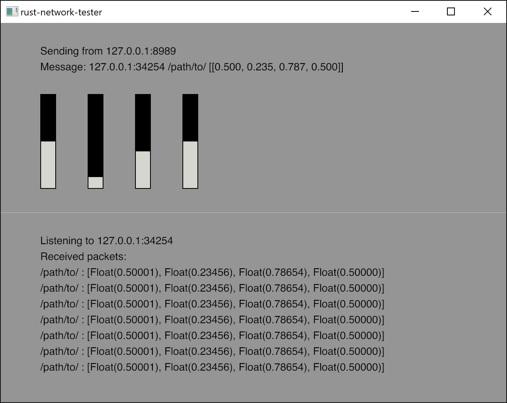

# rust-osc-tester
Rust base osc tester. If you need just a build program, go release page.



## Usage
You can manage basic osc setting from profile.json.
```json
{
    "width": 520,
    "height": 480,
    "osc_profile": {
        "rcv_addr": "127.0.0.1:34254",
        "snd_addr_fr": "127.0.0.1:8989",
        "snd_addr_to": "127.0.0.1:34254",
        "snd_path": "/path/to/",
        "snd_args": [
            {
                "default": 0.50001,
                "min": 0.0,
                "max": 1.0
            },
            {
                "default": 0.23456,
                "min": 0.0,
                "max": 2.0
            }
        ]
    }
}
```
